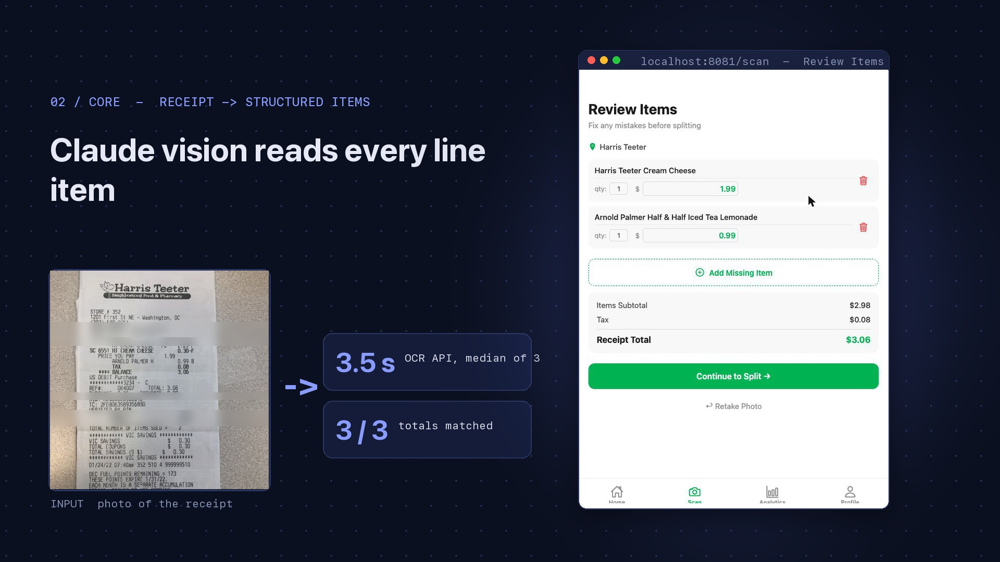
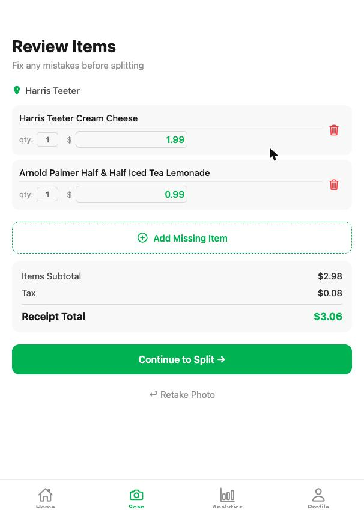
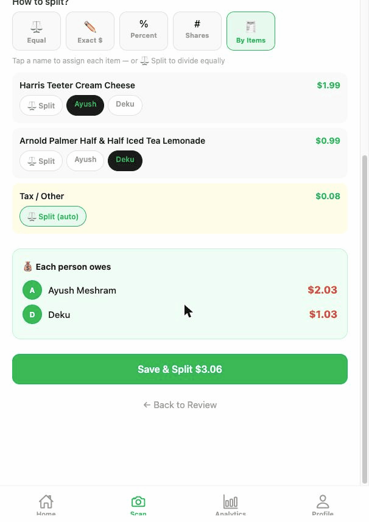
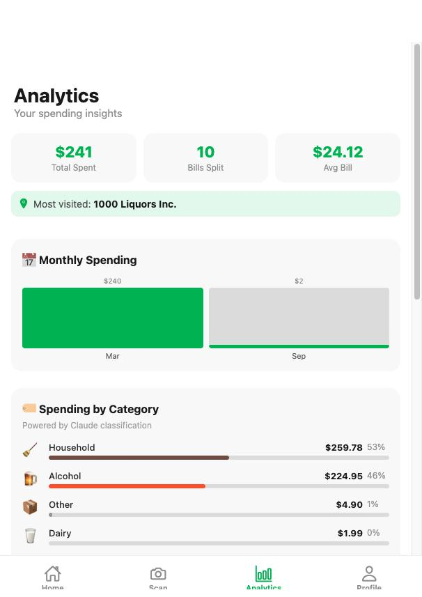

# SplitSmart

**Scan a grocery receipt. Split the bill. Track the spend.**

SplitSmart is a mobile app (React Native + Expo) with a FastAPI backend. You photograph a receipt, Claude vision extracts the store, line items, tax and total, and the app splits the bill across a group by item, percent, shares or equally. It then keeps a shared ledger, simplifies who owes whom, and shows spending analytics with AI-assigned categories.

Built as a Data Science Capstone project at George Mason University.

## Demo

[](docs/demo.mp4)

*40-second walkthrough recorded from the running app: upload a receipt, Claude reads it, split by item, saved to the group, bill detail, analytics. (Click the image to play `docs/demo.mp4`.)*

| Review scanned items | Split by item | Analytics |
|---|---|---|
|  |  |  |

## Features

**Receipt to items**
- Upload a photo or use the camera. Claude vision returns structured JSON: store, date, items (name, quantity, unit and total price), subtotal, tax, tip, total.
- A review screen lets you fix names, quantities and prices, or add a missing item before splitting.
- Manual entry for anything without a receipt (restaurant, gas, rent).

**Splitting and settling**
- Split modes: equal, exact amounts, percent, shares, or **by item** (tap who had what; tax is shared automatically).
- Groups with members and a per-group expense ledger; bill detail shows the payer, each person's share and every item.
- Settle Up uses a debt-simplification routine (`lib/debt-calculator.ts`) to minimize the number of payments, and records settlements.

**Insights**
- Analytics: total spent, bill count, average bill, monthly spend and spending by category and by group.
- Item categories (produce, dairy, meat and seafood, household, alcohol, and so on) are assigned by Claude, with a keyword fallback if the API call fails.
- Price Compass *(experimental)*: compares a cart across 11 DMV-area stores. See [Known limitations](#known-limitations).

## Architecture

```
Expo app (iOS / Android / web)
   |
   |-- REST (JSON) ------> FastAPI backend (:8000)
   |                          |-- Claude (receipt OCR + item categorization)
   |                          |-- Kroger Product API (live reference price)
   |                          '-- Store price index (11 stores, modeled)
   |
   '-- supabase-js -------> Supabase (Postgres + Auth)
```

The app talks to Supabase directly for auth, groups, bills and splits. Anything that needs the AI model or store prices goes through the Python backend so API keys never ship in the client.

## Tech stack

| Layer | Technology |
|---|---|
| Mobile app | React Native 0.81, Expo SDK 54, expo-router, TypeScript |
| Backend | Python 3.12, FastAPI, Uvicorn, httpx |
| AI | Anthropic Claude (vision for OCR, text for categorization) |
| Database and auth | Supabase (Postgres, Auth) |
| Prices | Kroger Product API (OAuth2) plus a modeled DMV store index |

## Measured results

These come from running this repo, not from a benchmark suite:

| Metric | Value | How it was measured |
|---|---|---|
| OCR API latency | **3.5 s** median | 3 calls to `/ocr/scan-receipt` with one Harris Teeter receipt photo (348x348), `claude-sonnet-5-5` |
| Receipt accuracy | **3 of 3** runs matched the receipt's items, tax ($0.08) and total ($3.06) | same 3 calls |
| Stores in price index | 11 | `GET /health` |

There is no formal accuracy evaluation yet. One low-resolution receipt is a smoke test, not a benchmark. With `claude-haiku-4-5` the same image produced invented line items, so the default model for OCR is Sonnet (see `ANTHROPIC_MODEL` below).

## Getting started

### Prerequisites
- Node.js 18+ and npm
- Python 3.12+
- A [Supabase](https://supabase.com) project
- An [Anthropic API key](https://console.anthropic.com)
- Optional: Kroger developer credentials ([developer.kroger.com](https://developer.kroger.com)) for live reference prices
- For the iOS Simulator: Xcode. Or use Expo Go on a phone, or the web build.

### 1. Clone and install

```bash
git clone https://github.com/DEKU-12/SplitSmart.git
cd SplitSmart
npm install --legacy-peer-deps
```

### 2. Configure environment variables

Create `.env` in the project root:

```env
EXPO_PUBLIC_SUPABASE_URL=https://<your-project-id>.supabase.co
EXPO_PUBLIC_SUPABASE_ANON_KEY=<your publishable / anon key>
EXPO_PUBLIC_API_URL=http://localhost:8000
```

Use your Mac's LAN IP instead of `localhost` when running on a physical phone.

Create `backend/.env`:

```env
ANTHROPIC_API_KEY=<your key>
ANTHROPIC_MODEL=claude-sonnet-5-5
# Optional
KROGER_CLIENT_ID=
KROGER_CLIENT_SECRET=
```

Both files are git-ignored. Never put a Supabase `service_role` or `sk-ant-` key in an `EXPO_PUBLIC_` variable.

### 3. Start the backend

```bash
cd backend
python3 -m venv .venv
source .venv/bin/activate
pip install -r requirements.txt
uvicorn main:app --reload --host 0.0.0.0 --port 8000
```

Check it: `curl localhost:8000/health` returns `{"status":"ok","stores":11}`.

### 4. Start the app

```bash
npx expo start
```

Press `i` for the iOS Simulator, `w` for web, or scan the QR code with Expo Go.

## API

| Method | Endpoint | Description |
|---|---|---|
| GET | `/health` | Health check and store count |
| POST | `/ocr/scan-receipt` | `{image_base64}` to extracted receipt JSON |
| POST | `/categorize` | `{items: [...]}` to `{categories: {name: category}}` |
| POST | `/compare-prices` | Categorized cart to per-store totals and per-item best prices |
| POST | `/scan-and-compare` | OCR, categorize and compare in one call |

## Database

Tables the app reads and writes (inferred from the queries in `app/` and `lib/`):

```
profiles       id, full_name, avatar_url, phone, created_at
groups         id, name, description, created_by, created_at
group_members  group_id, user_id, role, joined_at
bills          id, group_id, paid_by, description, total_amount, split_type, created_at
bill_items     id, bill_id, name, quantity, unit_price, total_price, category
bill_splits    id, bill_id, user_id, amount_owed
settlements    payments recorded by Settle Up
```

No SQL migration is committed yet. If you set up your own Supabase project, create these tables and **enable Row Level Security with policies** (for example, group members can read and write their group's bills). Without RLS the publishable key can read every row.

## Project structure

```
app/                  Expo Router screens
  (auth)/             login, signup
  (tabs)/             home, scan, analytics, profile, groups, price-compass
    group/            group detail, add-expense, bill-detail, settle
lib/                  api client, supabase client, types, categories, debt-calculator
backend/              FastAPI service: main.py, ocr.py, categorizer.py, stores.py, kroger.py
docs/                 demo video and screenshots
```

## Known limitations

- **Price Compass is experimental.** Only Kroger's price is a live API result, and it takes the first matching product, so a different size or brand can be compared against your item. Prices for the other 10 stores are modeled from DMV price indices and are marked "est." in the app. Treat the rankings as rough guidance.
- OCR quality depends on image quality; very small or blurry photos can fail, and the review screen exists for that reason.
- The Activity tab and member invites are placeholders.
- On web, the camera option does not work; use Upload Photo.
- `expo` packages are a few patch versions behind what Expo recommends (`npx expo install --check`).
- The repo has no automated tests yet.

## Roadmap

- Commit a Supabase schema and RLS policies
- Match products by size and unit before comparing prices
- Receipt accuracy evaluation on a labeled set
- Activity feed and invite flow

## License

MIT
